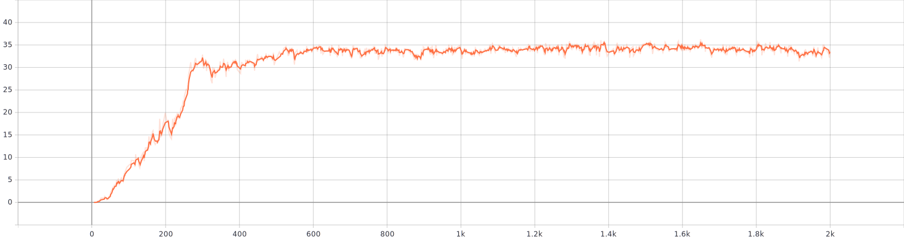

# Robotic Arm Continuous Control

## 1. Project Details:
The project is a part of **Udacity Deep Reinforcement Learning Nanodegree Project**. This is the *2nd Project Main Project,* where we trained the reinforcement learning agent with *policy gradient method*, with continuous action space.

In this environment, a double-jointed arm can move to target locations. A reward of +0.1 is provided for each step that the agent's hand is in the goal location. Thus, the goal of your agent is to maintain its position at the target location for as many time steps as possible.

The observation space consists of 33 variables corresponding to position, rotation, velocity, and angular velocities of the arm. Each action is a vector with four numbers, corresponding to torque applicable to two joints. Every entry in the action vector should be a number between -1 and 1.

### Solving the Environment 

The barrier for solving **the second version of the environment** is slightly different, to take into account the presence of many agents. In particular, your agents must get an **average score of +30 (over 100 consecutive episodes, and over all agents).** Specifically,

  - After each episode, we add up the rewards that each agent received (without discounting), to get a score for each agent. This yields 20 (potentially different) scores. We then take the average of these 20 scores.
  - This yields an average score for each episode (where the average is over all 20 agents).
As an example, consider the plot below, where we have plotted the average score (over all 20 agents) obtained with each episode.

The environment is considered solved, when the average (over 100 episodes) of those ***average scores is at least +30.***

### Distributed Training

This version contains 20 identical agents, each with its own copy of the environment. The environment is useful for algorithms like PPO, A3C, and D4PG that use multiple (non-interacting, parallel) copies of the same agent to distribute the task of gathering experience.

## 2. Getting Started:

### Prerequisite

A good understanding of artificial neural network and Q-learning will help you navigate throughout the documentation. In addition, python skillset must be at near intermediate for understanding the structure of the program. 

### Installation 

Download the environment from one of the links below.  You need only select the environment that matches your operating system:
  - **Twenty (20) Agents**
      - Linux: [click here](https://s3-us-west-1.amazonaws.com/udacity-drlnd/P2/Reacher/Reacher_Linux.zip)
      - Mac OSX: [click here](https://s3-us-west-1.amazonaws.com/udacity-drlnd/P2/Reacher/Reacher.app.zip)
      - Windows (32-bit): [click here](https://s3-us-west-1.amazonaws.com/udacity-drlnd/P2/Reacher/Reacher_Windows_x86.zip)
      - Windows (64-bit): [click here](https://s3-us-west-1.amazonaws.com/udacity-drlnd/P2/Reacher/Reacher_Windows_x86_64.zip)
    
(_For Windows users_) Check out [this link](https://support.microsoft.com/en-us/help/827218/how-to-determine-whether-a-computer-is-running-a-32-bit-version-or-64) if you need help with determining if your computer is running a 32-bit version or 64-bit version of the Windows operating system.

## 3. Instructions:

Follow the instructions in `Continuous_Control.ipynb` to get started with training your own agent!

## 4. Running the Tests:

## 5. Further Testing:

In version 2, I re-wrote the program to make it readable. I run a single experiment based on the learning from the previous runs. Now, we used tensorboardX to plot the rewards and the weights. 

Run the training through 10,000 episodes although it takes 24 hours with only just 2,000 episodes. Both, the previous training and local training converges at around 30 to 35 average rewards, although with an access to GPU, attaining the maximum score conclusively might have been faster.

<table>
  <tr>
    <th class="tg-yw4l" width=600, colspan=2><b>Experiment Details</b></th>
  </tr>
  <tr>
  <tr>
    <td class="tg-yw4l", width=150><b>Hyperparameters</td>
    <td class="tg-yw4l">
lr_critic= 0.00001  
                         lr_actor=  0.0005  
                         tau=0.05  
                         update_every=1 
 </td>
  </tr>
  <tr>
    <td class="tg-yw4l"><b>Parameters </b>  (Constant)</td>
    <td class="tg-yw4l">
buffer_size=10,000  
                                        batch_size=256
</td>
  </tr>
</table>

#### Results:

