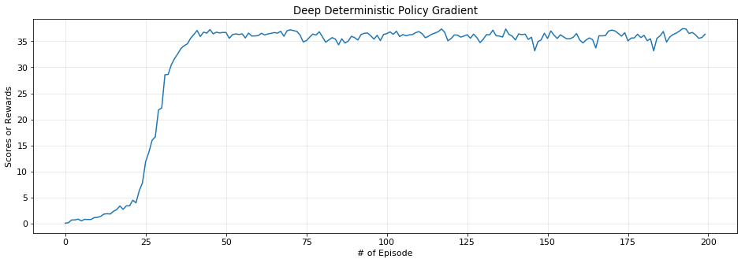

# Project Report

## 1. Deep Q-Network or DQN
As the state space and action sizes becomes significantly large, Q-Table becomes significantly inaccurate and harder to train. In DQN, neural network is introduced. A value-based reinforcement learning, where a function approximator seeks gradient of the action to know the optimal Q value function. “The parameter θ calculate Q values. Now, we can label **Q value function as Q(s,a;θ)**.”

The network can be composed of the following networks: artificial neural network (ANN), convolutional neural network (CNN) or a recurrent neural network (RNN). In this project, the **network architecture** consists of the dense networks with dueling networks that has the following parameters:

The **Actor Network:**
```
self.fc1 = nn.Linear(state_size, 512)
self.fc2 = nn.Linear(512, 256)
self.fc3 = nn.Linear(256, action_size)
```
The **Critic Network:**
```
self.fc1 = nn.Linear(state_size, 512)
self.fc2 = nn.Linear(512, 256)
self.fc3 = nn.Linear(256, action_size)
```

Knowing the environment, the process and the structure of DQN is extremely significant in building a more complex reinforcement learning agent. While the agent is the main part of the RL, the network is the brains of the agent. Therefore, we can say, the project was structure based on that following analogy. **The process of DQN, within each timestep,** are the following:
1.	**Select an Action**. Given the agent experience and information in the environment, the network selects a random action or pre-determined action.
2.	**Performs the selected action in the environment**. Given the action, the agent now will return a reward within the given state. 
3.	**Performs updates in the network**. This is where, the learning rate move its point in the gradient descent or function approximator to learn. 
4.	**Sample the Rewards**.
5.	**Move to the next state**. State = Next_State
6.	**Done?**


## 2. Summary of Params and Hyperparams of the Agent and of the Network
*Network Hyperparameters:*
```
# can be fine-tuned in the notebook itself
tau (interpolation parameter soft update): 0.001
lr_actor (learning rate actor): 1e-3
lr_critic (learning rate critic): 1e-4
```
*Agent Parameters / Hyperparameters:*
```
# can be fine-tuned in the notebook itself
Gamma or Discount Rate: 0.99
Buffer Size: 1e5
Batch Size: 100
Update Every: 1
```
*Training Parameters:*
```
Total Number of Episodes: 200
Maximum Number of Timesteps per Episodes: 2000
```

## 3. Final Results and Takeaways:

<p align=center></p>

## 4. Further Improvements


## Acknowledgement
- https://lilianweng.github.io/lil-log/2018/02/19/a-long-peek-into-reinforcement-learning.html


